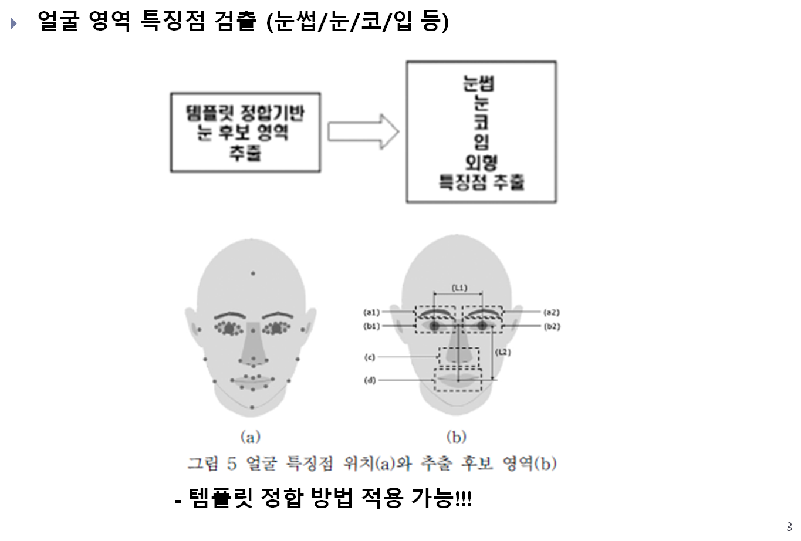
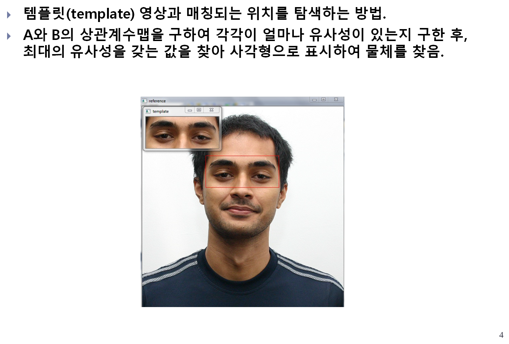
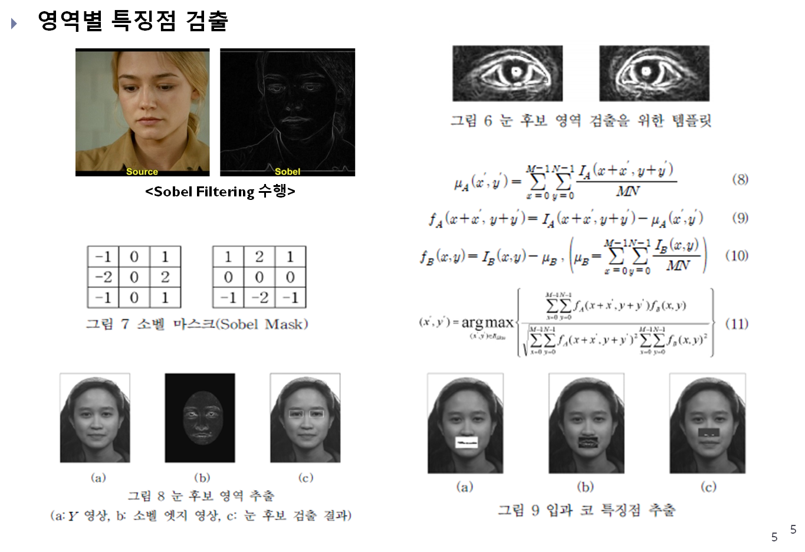
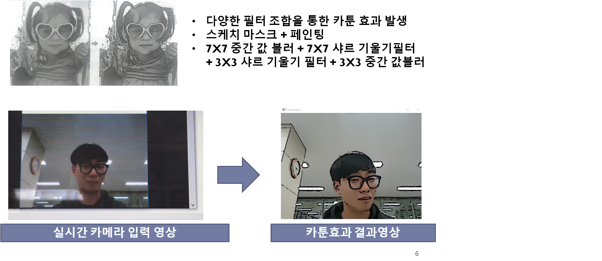
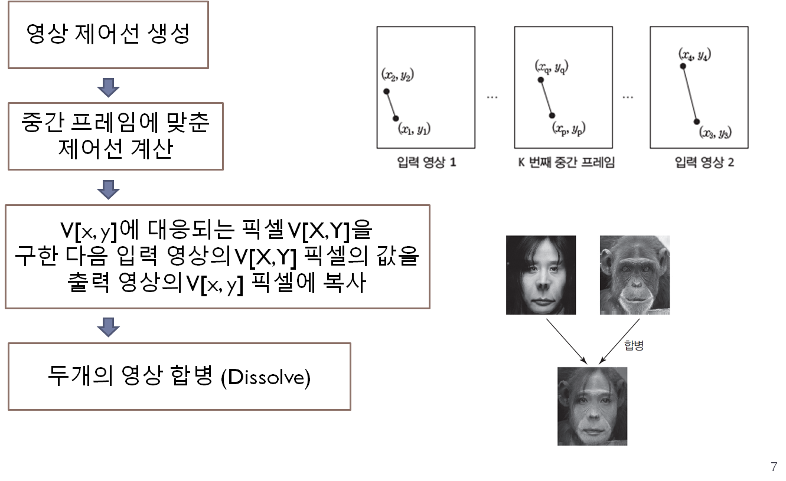
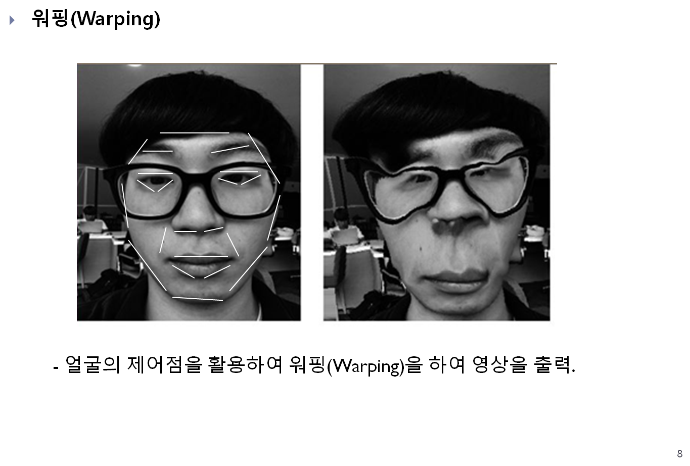
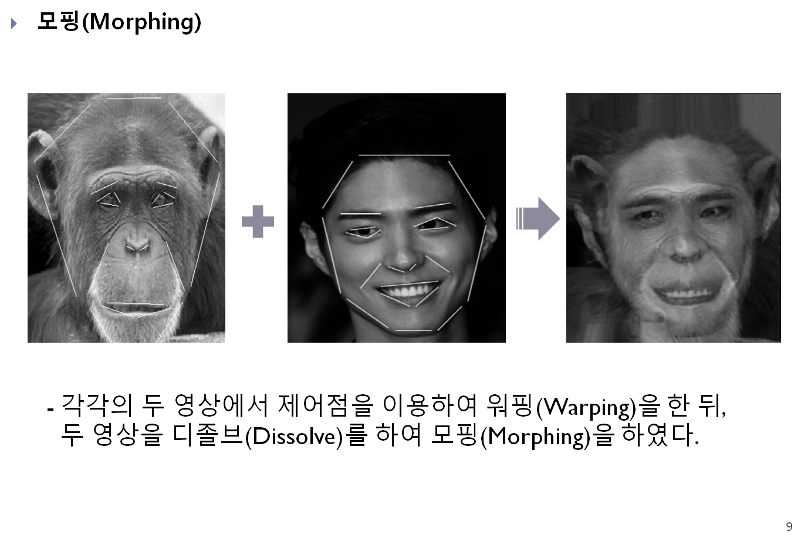
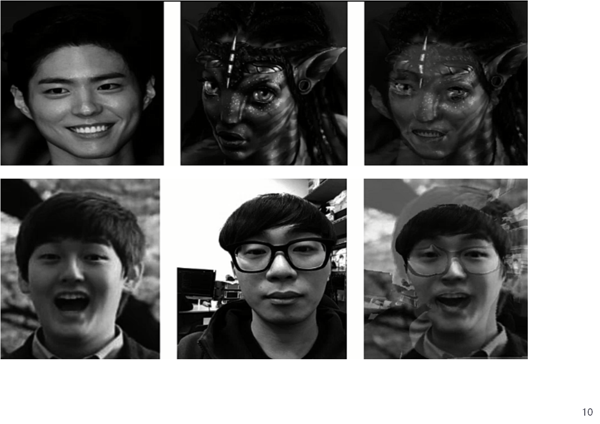
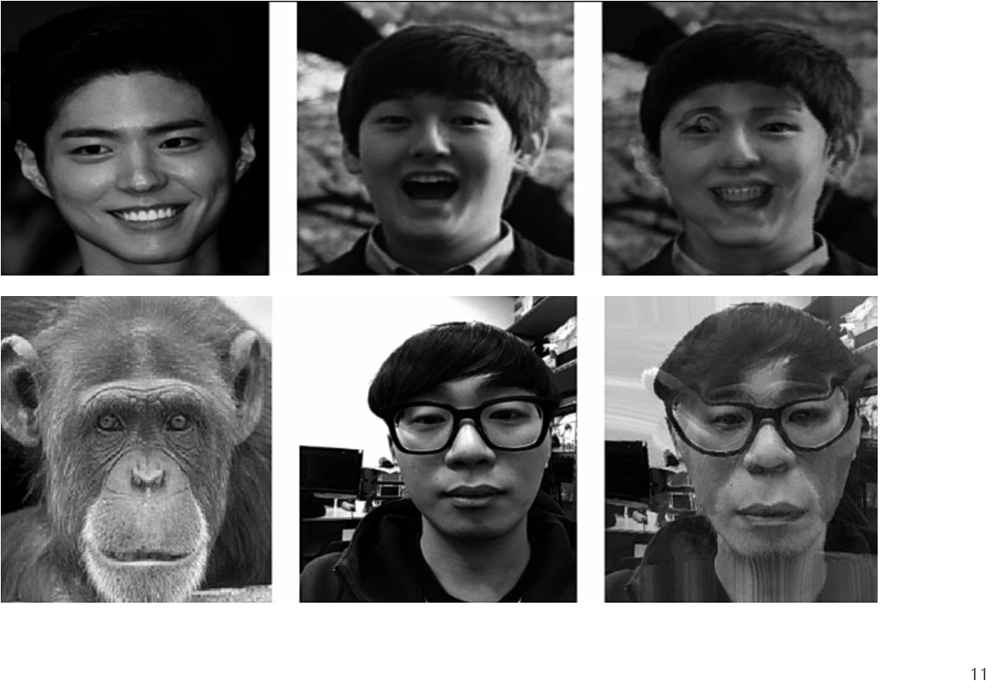
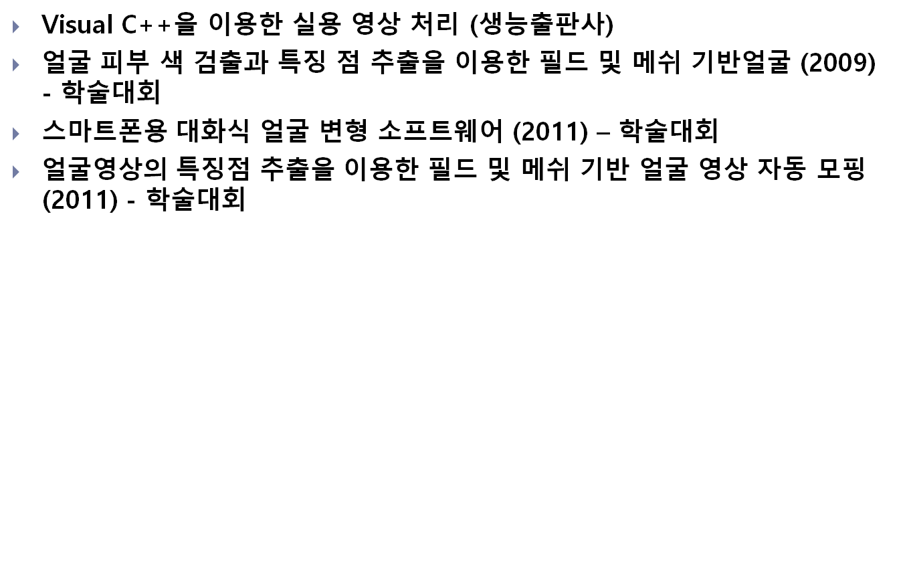

## 대용량이라 업로드가 안되어 소스코드만 첨부하였습니다!

-----
카메라를 활용한 제어점 이용 모핑 합성 기능 개발
-----

## 제안 알고리즘의 전체 블록도

## 얼굴 특징점 검출

## Template Matching

## 얼굴 특징점 검출

## CARTOON 효과

## 모핑 알고리즘 과정 (워핑+디졸브)

## 영상의 워핑과 모핑

## 모핑(Morphing)

-----
카메라를 활용한 제어점 이용 모핑 합성 기능 개발
-----

## 제안 알고리즘의 전체 블록도

## 얼굴 특징점 검출

## Template Matching

## 얼굴 특징점 검출

## CARTOON 효과

## 모핑 알고리즘 과정 (워핑+디졸브)

## 영상의 워핑과 모핑

## 모핑(Morphing)

-----
카메라를 활용한 제어점 이용 모핑 합성 기능 개발
-----

## 제안 알고리즘의 전체 블록도

## 얼굴 특징점 검출

## Template Matching

## 얼굴 특징점 검출

## CARTOON 효과

## 모핑 알고리즘 과정 (워핑+디졸브)

## 영상의 워핑과 모핑

## 모핑(Morphing)

## 참고 문헌

