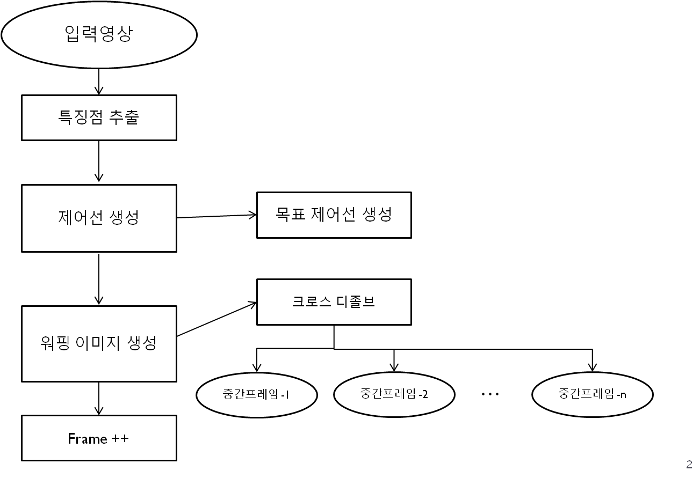

카메라를 활용한 제어점 이용 모핑 합성 기능 개발
-----

제안 알고리즘의 전체 블록도

## 프로젝트 진행 배경

의식주 문제가 해결되어진 최근 세계적으로 당뇨병환자가 폭발적으로 증가하고 있습니다. 
2020년에는 약 420만 명, 2050년에는 약 600만 명에 이르기까지, 당뇨병환자의 수는 빠르게 증가할 것으로 예상되고 있습니다.   
따라서 건강관리에 대한 중요성이 커지고 있는 상황입니다. 

## 프로젝트 필요성

세계적으로 건강관리에 대한 연구는 꾸준히 이루어져 왔고, 건강관리를 위한 다양한 기기들이 출시되어 왔습니다. 
하지만 항상 최신 기술이 포함될 때마다 최신 버전의 기기를 구매해야 하는 번거로움이 존재합니다.    
표준화된 방향이 필요하다고 생각하였고, 
이에 전국민의 96%에 달하는 비율이 스마트폰을 사용하고 있다는 점에 착안하여 혈당 관리 앱 개발 프로젝트를 진행하게 되었습니다. 

## 설계 내용
▶ 네비게이션 : 화면을 쉽게 이동하는 기능 
▶ 다이어리 : 당뇨수첩을 작성할 수 있는 기능으로 추가, 수정 및 삭제가 가능하며 다이어리 작성 시 장소, 사진, 메모, 혈당정보 등을 입력 가능 
▶ 차트 : 다이어리를 통해 입력한 혈당치를 그래프로 나타내주는 기능으로 사용자의 아침, 점심, 저녁, 취침 그리고 평균 혈당 값을 그래프로 확인 가능 
▶ 검색 : 사용자가 원하는 검색어를 입력하면 작성한 다이어리로부터 검색된 내용을 보여주는 기능 
▶ 사용자정보 : 사용자의 정보를 입력하는 기능 
▶ 설정 : 푸시알람 기능이 있고 케어센스몰 및 아이센스 홈페이지로 연결이 가능하며 개발자에게 문의할 수 있는 기능 

## Main Screen - 첫 번째 Fragment

사용자의 혈당 데이터를 그래프로 나타내주는 fragment입니다.    
하단의 floating action button 클릭 시, 어떠한 그래프를 선택할지 정하는 버튼이 나옵니다. 
원하는 버튼을 사용자가 누르면 해당하는 그래프를 화면에 출력하게 됩니다.     
평균 그래프의 경우 막대 그래프로 나타나며 그 외의 그래프는 꺾은선 그래프로 나타납니다. 

## Main Screen - 두 번째 Fragment

사용자가 기록한 로그 다이어리를 보여주는 fragment입니다. 
로그 다이어리는 시간, 장소, 사진, 혈당정보, 다이어리 내용 등을 포함하고 있습니다.      
페이스북, 인스타그램 등의 SNS에서 볼 수 있는 타임라인 방식으로 이루어져 있습니다.       
오른쪽 하단의 floating action button 클릭 시, 로그 다이어리를 추가하거나 삭제하는 버튼이 나옵니다. 

## 다이어리 추가

다이어리는 기본적으로 장소, 사진, 혈당, 다이어리 내용을 입력 가능하도록 하고 혈당을 입력하지 않아도 저장할 수 있습니다.     
혈당의 입력여부에 관계없이 로그 다이어리를 쓸 수 있도록 한 것은, 사용자로 하여금 혈당 로그 다이어리의 용도로만 쓰이는 것이 아니라, 메모장, 앨범, 일기장 등의 다양한 용도로 쓰일 수 있도록 유도하기 위함입니다.  
 
혈당을 입력하고 싶은 경우, 사과표시 옆의 ‘선택 시 길게 클릭’ 버튼을 길게 누르면 식사정보 선택 화면이 나옵니다.     
시간에 맞는 식사정보를 선택하면 혈당 수치를 입력할 수 있습니다.  

## 다이어리 삭제

다이어리 삭제 버튼을 누를 시 나오는 화면입니다.  
사용자가 삭제하고 싶은 다이어리를 직접 선택할 수 있고 전체 선택 버튼으로 전체 선택할 수 있습니다.  
선택 후 선택 삭제 버튼으로 해당 다이어리를 삭제할 수 있습니다. 

## 다이어리 수정

수정하고 싶은 로그 다이어리를 클릭하면 다이어리를 수정할 수 있는 context button이 나옵니다.  
Button 클릭 시 다이어리를 수정할 수 있는 화면이 나옵니다. 

## Main Screen - 세 번째 Fragment

사용자가 기록한 로그 다이어리를 검색할 수 있는 fragment입니다.    
검색 카테고리는 다이어리와 장소 두 가지입니다. 
카테고리를 선택한 후, 키워드를 입력하여 검색 바의 돋보기 버튼을 클릭하면 해당하는 로그 다이어리들의 간략한 내용과 함께 리스트 형태로 화면에 등장합니다.    
화면에 등장한 리스트들 중 보고 싶은 로그 다이어리를 클릭하면 더 자세하게 볼 수 있습니다. 

## 사용자 정보

상단 바의 왼쪽 프로필 버튼을 누르면 사용자 정보 화면이 나옵니다.    
입력 버튼 클릭 시 사용자 정보(사진, 이름, 생년월일, 성별)를 입력할 수 있습니다. 

## 설정

상단 바의 오른쪽 설정 버튼을 누르면 설정 화면이 나옵니다.    
푸시 알람은 식사 전/후 그리고 취침 전에 로그 다이어리를 기록하라는 알람을 보내는 기능입니다.    
알람은 아침 식사 전(7시), 아침 식사 후(9시), 점심 식사 전(12시), 점심 식사 후(14시), 저녁 식사 전(18시), 저녁 식사 후(20시), 취침 전(22시)으로 설정되어 있습니다.  

